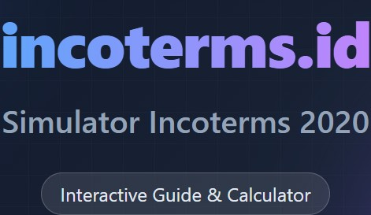

# Belajar Ekspor Impor

[](https://github.com/giangeralcus/incoterms-id/actions/workflows/build-check.yml)
[](LICENSE)
[](CONTRIBUTING.md)

Interactive Incoterms 2020 & Export-Import Simulator Game. Learn Indonesian freight forwarding through realistic shipping scenarios.

> Baca dalam Bahasa Indonesia: [README-ID.md](README-ID.md)

## Features

- **Learn Incoterms 2020** - All 11 rules with visual guides, obligations, risk/cost transfer points, and Indonesian trade context
- **Play Scenarios** - Pick the correct Incoterm for 26 real-world shipping scenarios from/to Indonesia (beginner, intermediate, advanced)
- **Cost Simulator** - Compare seller vs buyer costs across Incoterms + Indonesian Import Tax Calculator (BM, PPh22, PPN, PPnBM)
- **Progress Tracking** - Track mastery per Incoterm, accuracy, streaks, and scores
- **Bilingual** - Available in Indonesian and English, switchable anytime via header toggle

## Preview



## Tech Stack

| Component | Technology |
|-----------|-----------|
| Framework | React 19 + Vite |
| Styling | Tailwind CSS v4 |
| State | Zustand (persisted to localStorage) |
| Animation | Framer Motion |
| Icons | Lucide React |
| i18n | Zustand + translation objects (zero-dependency) |
| Deploy | Vercel |

## Getting Started

```bash
npm install
npm run dev
```

Open `http://localhost:5173` in your browser. Click the **EN/ID** button in the header to switch language.

## Contributing

Contributions are welcome, especially for:
- content accuracy and clarity
- Indonesian/English wording quality
- scenario realism and learning flow
- UI/UX and accessibility improvements

See [CONTRIBUTING.md](CONTRIBUTING.md) for setup and PR rules.

## Community

- Code of Conduct: [CODE_OF_CONDUCT.md](CODE_OF_CONDUCT.md)
- Report issues: [GitHub Issues](https://github.com/giangeralcus/incoterms-id/issues)

## License

This project is licensed under the MIT License. See [LICENSE](LICENSE).

## Context

Part of Gian's learning ecosystem for GPIndo freight forwarding business.
